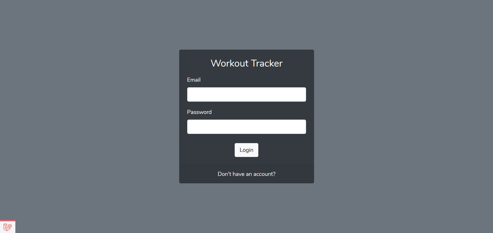
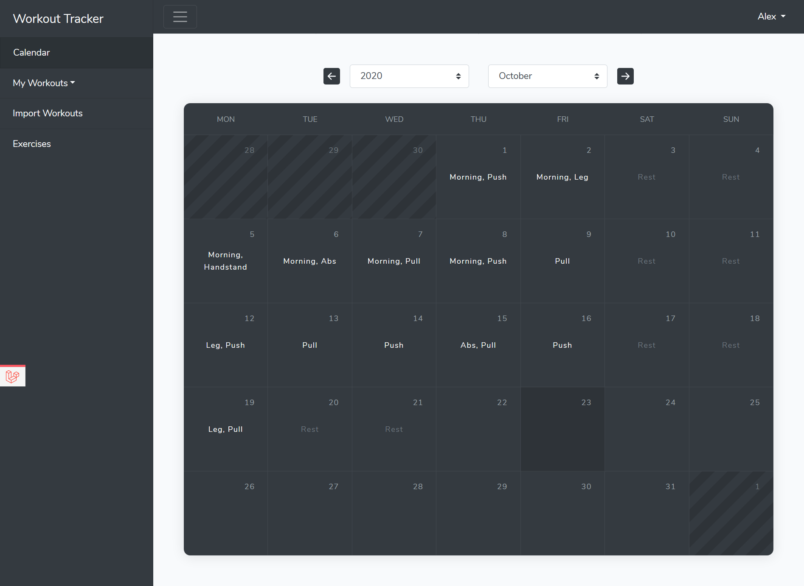
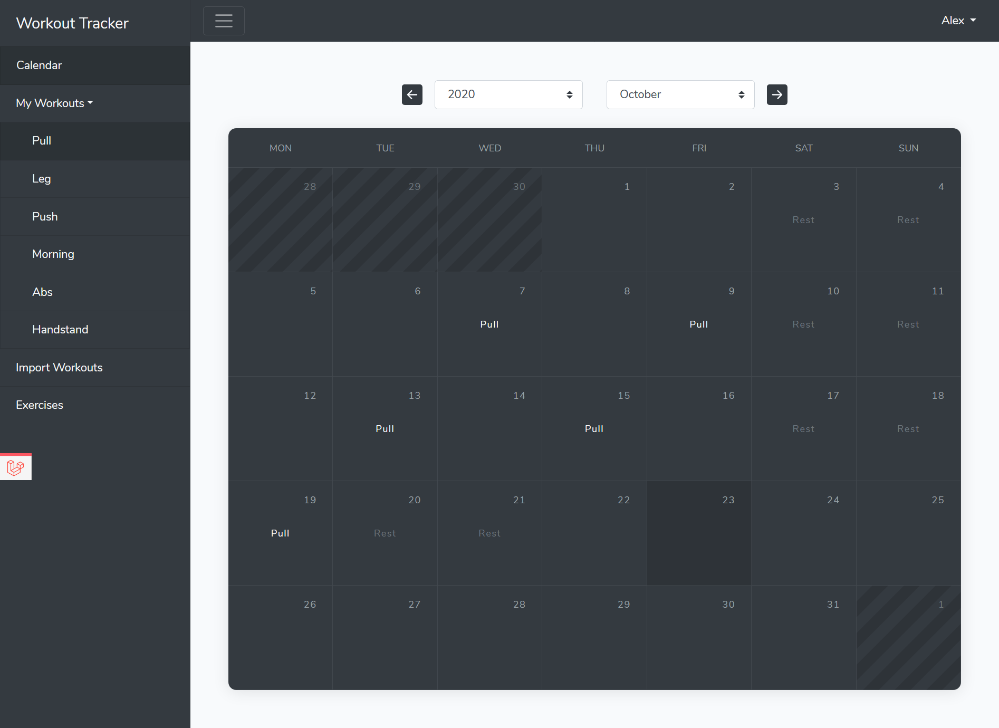
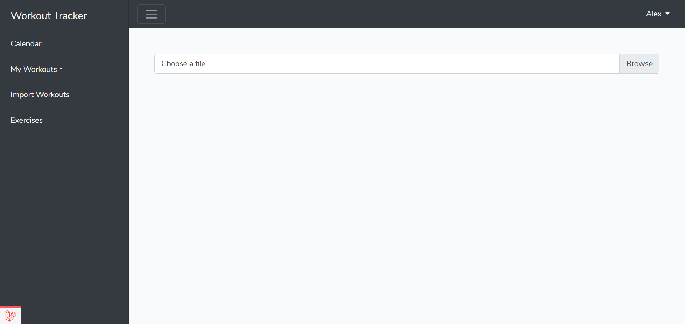
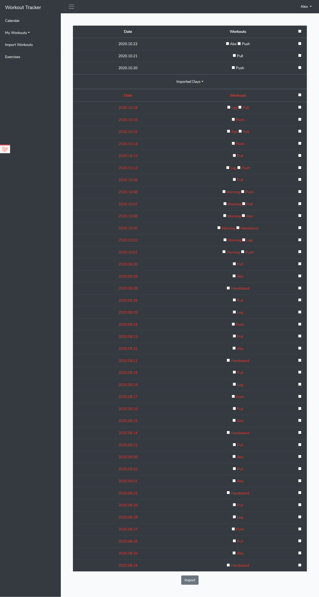
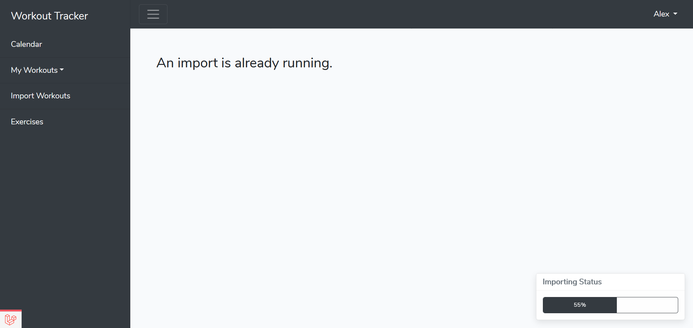
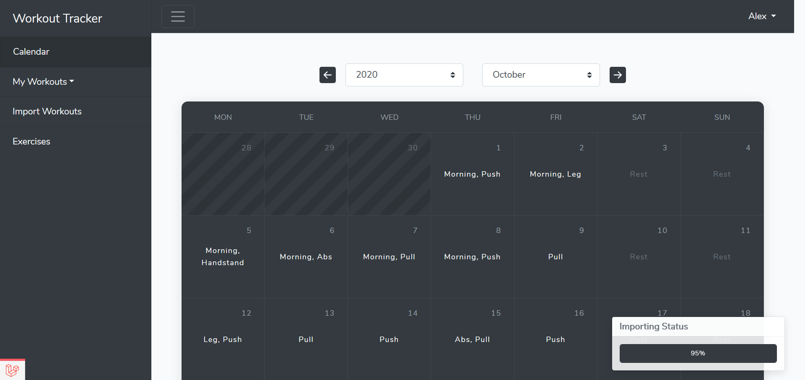
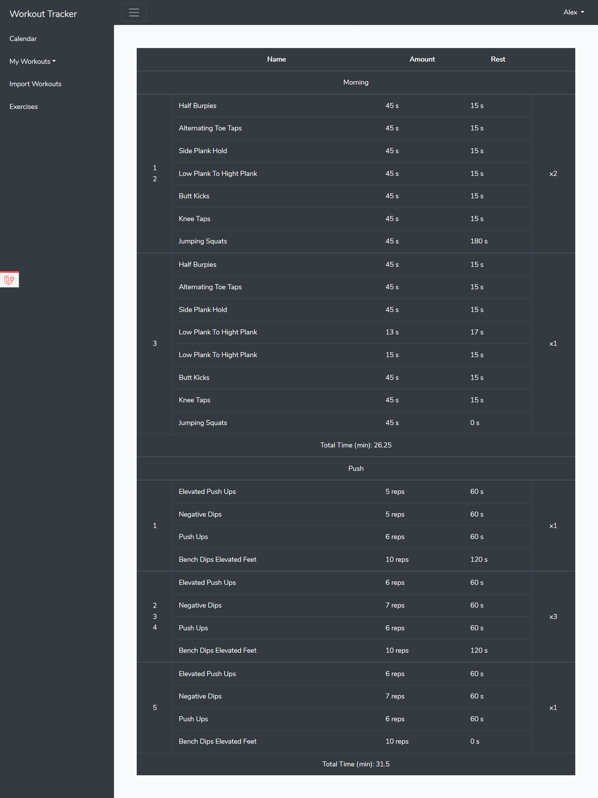

<h1 align="center">Workout Tracker</h1>

# About The Project

I created this project for myself to transfer my workout progress from an Excel spreadsheet to a MySQL database.

# Functionalities

## Multiple user handling

## Calendar to overview the workouts

## Filtering the calendar by workout

## Importing workouts

### You can select which days and workouts you want to import

### Live progress bar in the layout

## Workout page

### The similar sets are stacked

# Future plans

- More statistics for workouts and exercises.
- Improving the import speed
- Image upload for workouts

# Database schema
 
